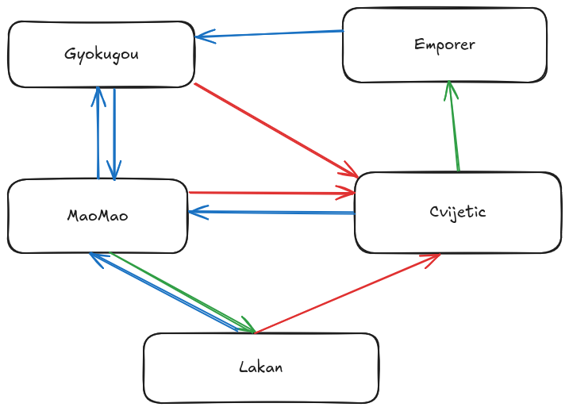

# Moore Machine on Multi-Layer Hopfield Networks

This repository provides a prototype implementation and theoretical model of a **Moore machine** constructed entirely using a **multi-layer Hopfield neural network**. The goal is to demonstrate the viability of implementing finite state machines (FSMs) within biologically plausible or digitally implemented Hopfield architectures—without auxiliary computational logic.

## 🔍 Overview

This project explores a novel way to merge concepts from automata theory with neuroscience-inspired computation. The model encodes Moore machine states as stable attractors in a Hopfield network’s energy landscape. Transitions are achieved through controlled perturbations of network state, simulating input-driven behavior typical of FSMs.

## 📄 Paper

The detailed explanation of the model, theoretical background, performance analysis, and comparisons to digital logic systems can be found in the draft [`Moore_Machine_on_Hopfield.pdf`](./Moore_Machine_on_Hopfield.pdf) or poster [`Split hopfield.pdf`](./Split%20hopfield.pdf).

## 🔄 State Transitions



The diagram above illustrates the character relationship network used in this implementation:

-   **Blue lines**: "LIKES" relationships - showing affection/attraction between characters
-   **Green lines**: "FATHER_OF" relationships - depicting parental connections
-   **Red lines**: "BULLIES" relationships - representing antagonistic interactions

Each relationship type corresponds to a different input signal that triggers specific state transitions in the Moore machine. The network learns these relationships as associative memory patterns and can recall the appropriate target state when given a current state and relationship input.

## 🧠 Key Concepts

-   **Moore Machine**: A type of FSM where outputs depend only on the current state.
-   **Hopfield Network**: A recurrent neural network that minimizes an energy function to settle into memory-like attractor states.
-   **Multi-Layer Architecture**: Extends classical Hopfield networks by stacking layers, enabling richer and more complex state transitions.
-   **Biological Plausibility**: The design leverages biologically inspired neuron features (thresholds, oscillations, "write-enable"-like behavior) to achieve logic gate equivalents.

## 📁 Project Structure

```
hopfield_sequential/
├── README.md                          # This file
├── Moore_Machine_on_Hopfield.pdf      # Research paper
├── state_transitions.png              # Character relationship diagram
├── main.py                            # Main execution script
├── sequential.py                      # SequentialNetwork class implementation
├── src/
│   ├── network.py                     # Base Network class
│   ├── hopfieldNetwork.py             # HopfieldNetwork implementation
│   ├── state_generator.py             # Orthogonal state vector generation
│   └── utils.py                       # Utility functions for minterm generation
└── .gitignore                         # Git ignore rules
```

### Core Components

-   **`sequential.py`**: Main orchestrator class that sets up the multi-layer network architecture
-   **`src/network.py`**: Base network class with inter-layer connectivity and apical state computation
-   **`src/hopfieldNetwork.py`**: Hopfield associative memory implementation with pattern storage and recall
-   **`src/utils.py`**: Utility functions for creating minterm data and generating weight matrices
-   **`state_generator.py`**: Generates orthogonal bipolar vectors for character state representation
